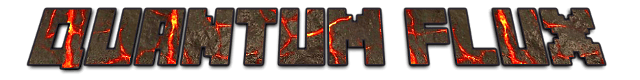

## QuantumFlux for Minecraft
QuantumFlux is a Forge mod for Minecraft that focuses on adding ways to generate, store, and transport RF power. More information can be found on the official [forum topic](http://bitly.com/19gUP8j) or the wiki.

### Ownership
This repository contains the official QuantumFlux source code since Minecraft 1.11. (see: [Ownership of QuantumFlux changing](https://www.reddit.com/r/feedthebeast/comments/8zb4i2/ownership_of_quantumflux_changing/))

### Downloads
The official releases can be found at [CurseForge](https://www.curseforge.com/minecraft/mc-mods/quantumflux).

### Modpack Distribution
Sure, please link to the [CurseForge project](https://minecraft.curseforge.com/projects/quantumflux) page though. Just don't be a jerk, make claims you can't back, or sell mod items on your server.

### License
**Copyright 2015 Joe Kaiser**  

Permission is hereby granted, free of charge, to any person obtaining a copy of this software and associated documentation files (the "Software"), to deal in the Software without restriction, including without limitation the rights to use, copy, modify, merge, publish, distribute, and to permit persons to whom the Software is furnished to do so, subject to the following conditions:

You may not sublicense, and/or sell copies of the Software.
The above copyright notice and this permission notice shall be included in all copies or substantial portions of the Software.
Don't be a jerk.

THE SOFTWARE IS PROVIDED "AS IS", WITHOUT WARRANTY OF ANY KIND, EXPRESS OR IMPLIED, INCLUDING BUT NOT LIMITED TO THE WARRANTIES OF MERCHANTABILITY, FITNESS FOR A PARTICULAR PURPOSE AND NONINFRINGEMENT. IN NO EVENT SHALL THE AUTHORS OR COPYRIGHT HOLDERS BE LIABLE FOR ANY CLAIM, DAMAGES OR OTHER LIABILITY, WHETHER IN AN ACTION OF CONTRACT, TORT OR OTHERWISE, ARISING FROM, OUT OF OR IN CONNECTION WITH THE SOFTWARE OR THE USE OR OTHER DEALINGS IN THE SOFTWARE.
